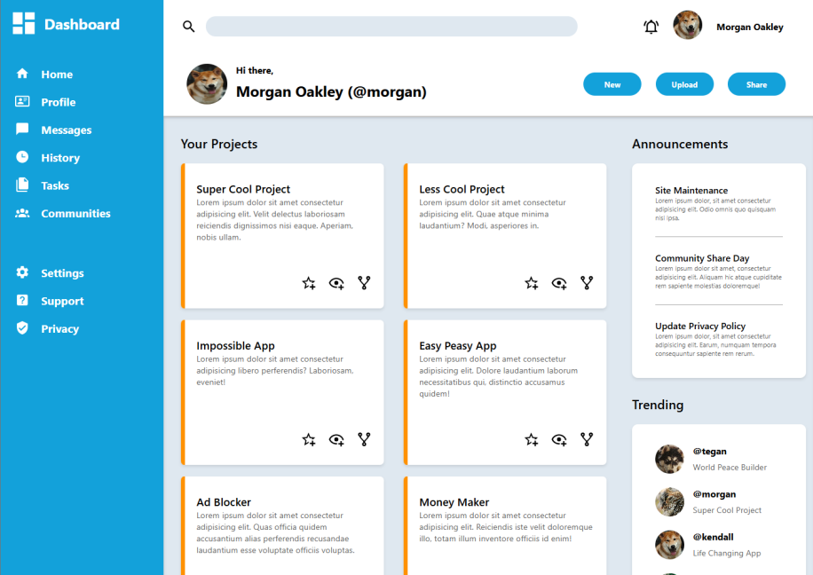

# Admin-Dashboard

This project is a modern, responsive admin dashboard designed to provide a user-friendly interface for managing various administrative tasks. Built with HTML & CSS it offers a clean and intuitive design, ensuring efficient navigation and data management.

## Table of Content

- [Live Website](#live-website)
- [Preview](#preview)
- [Features](#features)
- [Technologies Used](#technologies-used)
- [Layout and Design](#layout-and-design)
- [Getting Started](#getting-started)
- [Contributing](#contributing)
- [License](#license)

## Live Website

- Live Preview: [Admin Dashboard](https://rajatthedev.github.io/Admin-Dashboard/)

## Preview

## Features

- *Dashboard Overview:** Provides a summary of key metrics and data points for quick insights.
- **Announcements Section:** Dedicated space for displaying important announcements and updates.
- **Trending Topics:** Highlights current trending users relevant to the admin's focus.

## Technologies Used

- **HTML5:** Used for structuring the content and elements of the web application.
- **CSS:** - **CSS:** Applied for styling and enhancing the visual presentation of the admin dashboard.

## Layout and Design

This project utilizes CSS Grid Layout extensively to create a responsive and flexible design. By leveraging CSS Grid, the dashboard ensures that components are well-organized and adapt seamlessly to various screen sizes. Key implementations include:

- **Responsive Grid System:** The dashboard layout adjusts dynamically, providing an optimal viewing experience across devices.
- **Flexible Card Arrangement:** The project cards are arranged using CSS Grid properties, allowing for an auto-fit layout that adapts to the content and screen size.

These implementations demonstrate a strong grasp of modern CSS techniques, ensuring both functionality and aesthetics in the dashboard's design.

## Getting Started

Follow these steps in order to kickstart your project:

1. Clone the Repository: `git clone git@github.com:RajatTheDev/Admin-Dashboard.git`
2. Open the `index.html` file in your preferred browser to view the content. 🌐

## Contributing

If you have fantastic ideas or improvements to enhance this project, I welcome your contributions! Feel free to fork the repository and submit a pull request to share your insights and make this project even better. Your input is highly valued! 🚀

## License

This project is covered by the [MIT License](LICENSE), which means it's open for collaboration and sharing.